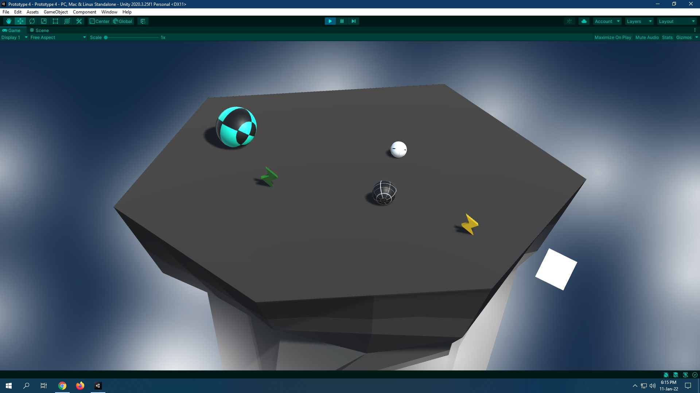

# CWC_Prototype4-Unity
Unity Learn - Junior Programmer: Create with Code 2 - Unit 4: Gameplay Mechanics.

No fabricated branch because I could only implement the easy feature on my own.

Followed [this solution by Unity](https://connect-prd-cdn.unity.com/20210505/028d9307-6747-43de-ace2-26e4ee679176/Unit%204%20-%20Bonus%20Features%20Solutions.pdf?_ga=2.252219658.2037994957.1641447575-372347527.1640751420).

